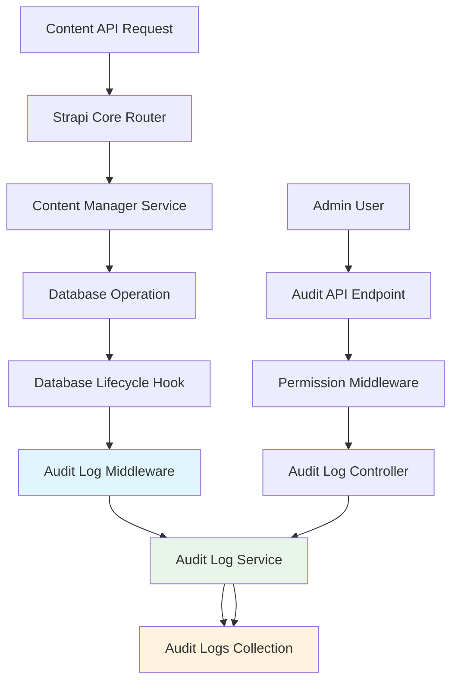

# Design Document - Automated Audit Logging

## Overview

The Automated Audit Logging feature will be implemented as a Strapi plugin that integrates seamlessly with the existing architecture. The system will capture all content operations (create, update, delete) performed through Strapi's Content API and provide a secure REST endpoint for retrieving audit logs with filtering and pagination capabilities.

## Architecture

### High-Level Architecture



### Component Integration

The audit logging system integrates with Strapi's core components:

1. **Database Lifecycle Hooks**: Capture content operations at the database level
2. **Permission System**: Secure access to audit logs using Strapi's RBAC
3. **Plugin Architecture**: Modular implementation following Strapi patterns
4. **Configuration System**: Configurable behavior through Strapi's config system

## Components and Interfaces

### 1. Audit Log Plugin Structure

```
plugins/audit-logging/
├── server/
│   ├── controllers/
│   │   └── audit-log.js
│   ├── services/
│   │   └── audit-log.js
│   ├── routes/
│   │   └── audit-log.js
│   ├── content-types/
│   │   └── audit-log/
│   │       └── schema.json
│   ├── middlewares/
│   │   └── audit-capture.js
│   ├── config/
│   │   └── permissions.js
│   ├── bootstrap.js
│   └── register.js
└── package.json
```

### 2. Core Components

#### Audit Log Middleware
- **Purpose**: Intercept database operations and trigger audit logging
- **Integration Point**: Database lifecycle hooks (`afterCreate`, `afterUpdate`, `afterDelete`)
- **Responsibilities**:
  - Extract operation metadata
  - Determine if logging is enabled for the content type
  - Asynchronously create audit log entries

#### Audit Log Service
- **Purpose**: Business logic for audit log management
- **Methods**:
  - `createAuditEntry(operation, metadata)`: Create new audit log entry
  - `findAuditLogs(filters, pagination)`: Retrieve filtered audit logs
  - `isLoggingEnabled(contentType)`: Check if logging is enabled for content type
- **Integration**: Uses Strapi's service pattern (`strapi.service('plugin::audit-logging.audit-log')`)

#### Audit Log Controller
- **Purpose**: Handle HTTP requests for audit log API
- **Methods**:
  - `find(ctx)`: GET /audit-logs endpoint with filtering and pagination
- **Security**: Integrates with Strapi's permission middleware

#### Permission Integration
- **New Permission**: `plugin::audit-logging.read`
- **Registration**: Bootstrap phase using `actionProvider.registerMany()`
- **Enforcement**: Controller-level permission checking

## Data Models

### Audit Log Schema

```json
{
  "kind": "collectionType",
  "collectionName": "audit_logs",
  "info": {
    "singularName": "audit-log",
    "pluralName": "audit-logs",
    "displayName": "Audit Log"
  },
  "options": {
    "draftAndPublish": false,
    "timestamps": true
  },
  "attributes": {
    "contentType": {
      "type": "string",
      "required": true
    },
    "recordId": {
      "type": "string",
      "required": true
    },
    "action": {
      "type": "enumeration",
      "enum": ["create", "update", "delete"],
      "required": true
    },
    "userId": {
      "type": "integer",
      "required": false
    },
    "payload": {
      "type": "json",
      "required": false
    },
    "changedFields": {
      "type": "json",
      "required": false
    },
    "timestamp": {
      "type": "datetime",
      "required": true
    },
    "userAgent": {
      "type": "string",
      "required": false
    },
    "ipAddress": {
      "type": "string",
      "required": false
    }
  }
}
```

### Database Indexes

```sql
-- Primary performance indexes
CREATE INDEX idx_audit_logs_content_type ON audit_logs(content_type);
CREATE INDEX idx_audit_logs_user_id ON audit_logs(user_id);
CREATE INDEX idx_audit_logs_action ON audit_logs(action);
CREATE INDEX idx_audit_logs_timestamp ON audit_logs(timestamp);

-- Composite indexes for common query patterns
CREATE INDEX idx_audit_logs_content_type_timestamp ON audit_logs(content_type, timestamp);
CREATE INDEX idx_audit_logs_user_action ON audit_logs(user_id, action);
```

## Error Handling

### Graceful Degradation Strategy

1. **Audit Logging Failures**: Never block content operations
2. **Async Processing**: All audit logging happens asynchronously
3. **Error Logging**: Failed audit operations logged to Strapi's logger
4. **Fallback Behavior**: Continue content operations even if audit logging fails

### Error Scenarios

```javascript
// Example error handling in audit middleware
try {
  await auditLogService.createAuditEntry(operation, metadata);
} catch (error) {
  strapi.log.error('Audit logging failed:', {
    error: error.message,
    operation,
    contentType: metadata.contentType,
    recordId: metadata.recordId
  });
  // Continue without throwing - don't block content operations
}
```

## Testing Strategy

### Unit Tests

1. **Audit Log Service Tests**
   - Test audit entry creation with various payloads
   - Test filtering and pagination logic
   - Test configuration handling

2. **Middleware Tests**
   - Test lifecycle hook integration
   - Test async error handling
   - Test configuration-based exclusions

3. **Controller Tests**
   - Test permission enforcement
   - Test API response formatting
   - Test query parameter validation

### Integration Tests

1. **End-to-End Audit Flow**
   - Create content → verify audit log created
   - Update content → verify audit log with changed fields
   - Delete content → verify audit log with full payload

2. **Permission Integration**
   - Test access control with different user roles
   - Test unauthorized access scenarios

3. **Configuration Tests**
   - Test enabling/disabling audit logging
   - Test content type exclusions

### Performance Tests

1. **High-Volume Operations**
   - Test audit logging under heavy content creation load
   - Measure impact on content API response times

2. **Database Performance**
   - Test query performance with large audit log datasets
   - Validate index effectiveness

## Configuration Integration

### Plugin Configuration

```javascript
// config/plugins.js
module.exports = {
  'audit-logging': {
    enabled: true,
    config: {
      auditLog: {
        enabled: true,
        excludeContentTypes: ['strapi::core-store', 'admin::user'],
        retentionDays: 365, // Optional: auto-cleanup after N days
        captureUserAgent: true,
        captureIpAddress: true
      }
    }
  }
};
```

### Environment Variables

```bash
# Optional environment overrides
STRAPI_AUDIT_LOG_ENABLED=true
STRAPI_AUDIT_LOG_RETENTION_DAYS=365
```

## Security Considerations

### Data Protection

1. **Sensitive Data Handling**: Audit logs may contain sensitive information
2. **Access Control**: Strict permission-based access to audit logs
3. **Data Retention**: Configurable retention policies for compliance

### Permission Model

```javascript
// New permission action
{
  section: 'plugins',
  displayName: 'Read audit logs',
  uid: 'plugin::audit-logging.read',
  pluginName: 'audit-logging'
}
```

## Performance Optimization

### Async Processing

- All audit logging operations are non-blocking
- Use of Strapi's event system for decoupled processing
- Background processing to minimize API response time impact

### Database Optimization

- Strategic indexing for common query patterns
- Pagination limits to prevent large result sets
- Optional data archiving for long-term retention

### Memory Management

- Streaming for large audit log exports
- Configurable batch sizes for bulk operations
- Efficient JSON handling for payload storage

## API Design

### Audit Logs Endpoint

```
GET /api/audit-logs
```

#### Query Parameters

| Parameter | Type | Description | Example |
|-----------|------|-------------|---------|
| `contentType` | string | Filter by content type | `api::article.article` |
| `userId` | integer | Filter by user ID | `1` |
| `action` | string | Filter by action type | `create,update` |
| `startDate` | ISO date | Start of date range | `2024-01-01T00:00:00Z` |
| `endDate` | ISO date | End of date range | `2024-12-31T23:59:59Z` |
| `page` | integer | Page number (1-based) | `1` |
| `pageSize` | integer | Items per page (max 100) | `25` |
| `sort` | string | Sort field and direction | `timestamp:desc` |

#### Response Format

```json
{
  "data": [
    {
      "id": 1,
      "contentType": "api::article.article",
      "recordId": "123",
      "action": "update",
      "userId": 1,
      "timestamp": "2024-01-15T10:30:00Z",
      "changedFields": {
        "title": "New Article Title",
        "updatedAt": "2024-01-15T10:30:00Z"
      },
      "userAgent": "Mozilla/5.0...",
      "ipAddress": "192.168.1.100"
    }
  ],
  "meta": {
    "pagination": {
      "page": 1,
      "pageSize": 25,
      "pageCount": 10,
      "total": 250
    }
  }
}
```

## Migration Strategy

### Database Migration

The plugin will include a migration to create the audit_logs table with proper indexes:

```javascript
// migrations/001-create-audit-logs-table.js
module.exports = {
  async up(knex) {
    await knex.schema.createTable('audit_logs', (table) => {
      table.increments('id').primary();
      table.string('content_type').notNullable();
      table.string('record_id').notNullable();
      table.enum('action', ['create', 'update', 'delete']).notNullable();
      table.integer('user_id').nullable();
      table.json('payload').nullable();
      table.json('changed_fields').nullable();
      table.datetime('timestamp').notNullable();
      table.string('user_agent').nullable();
      table.string('ip_address').nullable();
      table.timestamps(true, true);
      
      // Indexes
      table.index('content_type');
      table.index('user_id');
      table.index('action');
      table.index('timestamp');
      table.index(['content_type', 'timestamp']);
    });
  },
  
  async down(knex) {
    await knex.schema.dropTable('audit_logs');
  }
};
```

This design ensures seamless integration with Strapi's existing architecture while providing comprehensive audit logging capabilities with proper security, performance, and maintainability considerations.